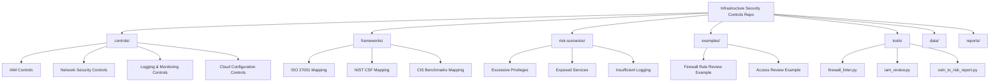
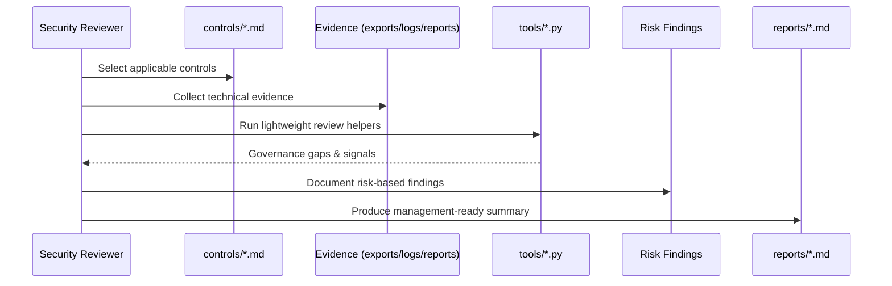
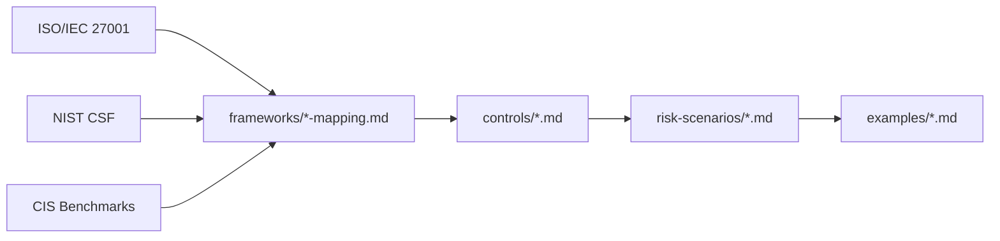

Architecture, Workflow & Security Model
Project Overview

This repository demonstrates a controls-first approach to infrastructure and cloud security.
It bridges formal security frameworks with practical infrastructure reviews, realistic risk scenarios, and lightweight automation to support governance, assurance, and engineering-aligned security decisions.

Repository Structure

The repository is organised to reflect how infrastructure security is typically assessed in real environments.

How the Repository Is Used

The workflow mirrors a real infrastructure security or assurance engagement: controls → evidence → findings → reporting.

Control & Framework Mapping Logic

Security frameworks provide structure, while controls define expectations and risk scenarios explain failure modes.

